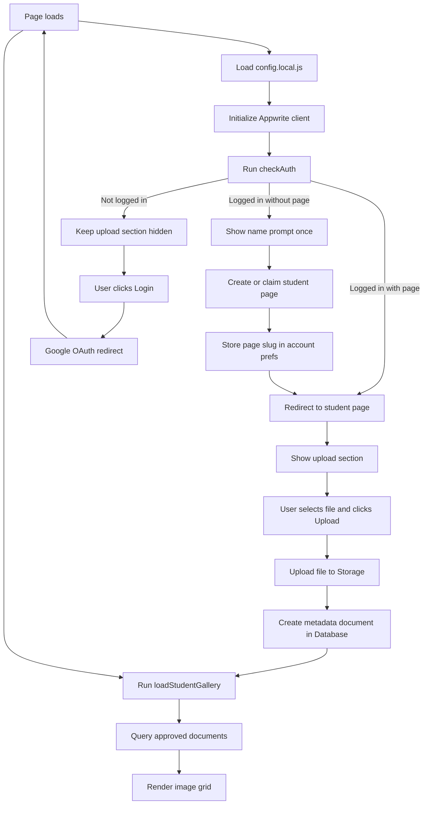
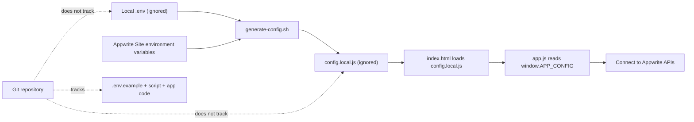

# psych-honours-2026

## Local setup (secret-safe)

1. Copy example env file:
	- `cp .env.example .env`
2. Fill in your Appwrite values in `.env`.
3. Install dependencies:
	- `npm install`
4. Build Tailwind CSS:
	- `npm run build:css`
5. Generate runtime config for the browser:
	- `./scripts/generate-config.sh`
6. Open `index.html` (or run a local static server).

`config.local.js` and `.env` are ignored by Git and should never be committed.

## Deploy on Appwrite Sites (GitHub source)

This repo is set up for Appwrite Sites with environment variables injected at build time.

### Appwrite Site settings

- **Repository:** `sxn-star/psych-honours-2026`
- **Production branch:** `main`
- **Install command:** `npm ci`
- **Build command:** `npm run build:css && bash ./scripts/generate-config.sh`
- **Output directory:** `.`

### Environment variables (in Appwrite Site)

Add these in your Appwrite Site environment settings:

- `APPWRITE_ENDPOINT` = `https://cloud.appwrite.io/v1`
- `APPWRITE_PROJECT_ID` = your project id
- `APPWRITE_BUCKET_ID` = your storage bucket id
- `APPWRITE_DATABASE_ID` = your database id
- `APPWRITE_COLLECTION_ID` = your collection id
- `APPWRITE_STUDENT_PAGES_COLLECTION_ID` = the collection that stores student page records
- `APPWRITE_ALLOWED_DOMAIN` = the only email domain allowed to create pages or upload content

### Important security notes

- Do **not** store server API keys in this frontend project.
- Project/database/bucket/collection IDs are configuration values for the client app.
- Access control is enforced by your Appwrite permissions and auth rules.
- Domain restriction is enforced by `APPWRITE_ALLOWED_DOMAIN`; if it is unset, any authenticated Google account can proceed.
- `git-secrets` is enabled in this repo as an extra commit-time protection layer.

## Student Pages Collection Setup

To enable first-login onboarding (where students enter their name once and get a personal page):

1. Read [docs/appwrite-student-pages.md](docs/appwrite-student-pages.md) for detailed setup steps.
2. Create a collection in Appwrite with the specified attributes and indexes.
3. Set `APPWRITE_STUDENT_PAGES_COLLECTION_ID` in your environment.
4. Deploy and test login flow.

**Without this collection:** The app falls back to the static student list in `students.js`.

## App flow diagram

## Config and secret-safe flow

## Optional: Domain-enforcement function (Git deployment)

This repo includes a function scaffold at `functions/enforce-org-domain`.

Use these values in Appwrite Function settings when connecting this repo:

- **Repository:** `sxn-star/psych-honours-2026`
- **Branch:** `main`
- **Root directory:** `functions/enforce-org-domain`
- **Entrypoint:** `src/main.js`
- **Build commands:** `npm install`

Set these function environment variables:

- `APPWRITE_ENDPOINT` = `https://cloud.appwrite.io/v1`
- `APPWRITE_PROJECT_ID` = your project id
- `APPWRITE_API_KEY` = API key with user read/write scopes (set as secret)
- `ALLOWED_DOMAIN` = allowed email domain (example: `example.org`)

Add a user-created event trigger so the function runs automatically when a new user signs up. Disallowed domains are labeled as `orgblocked`; allowed domains are labeled as `orgallowed`.