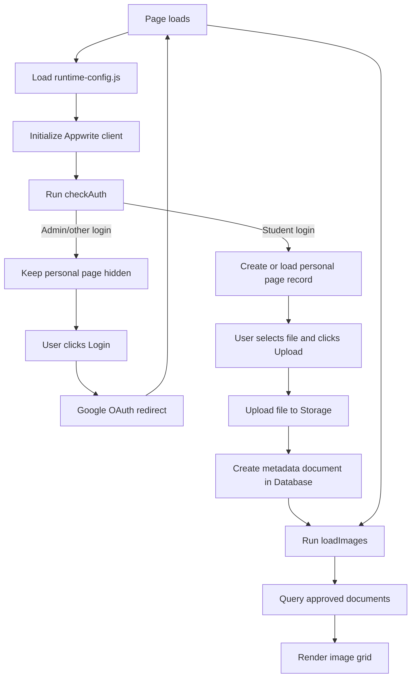
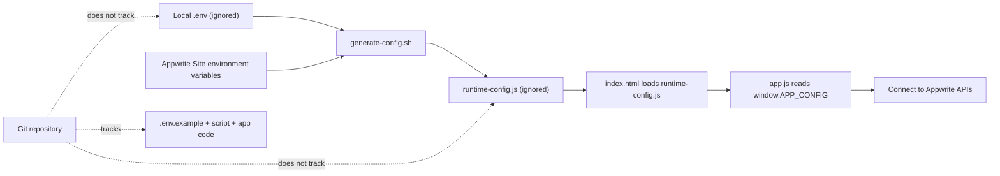

# psych-honours-2026

## Local setup (secret-safe)

1. Copy example env file:
	- `cp .env.example .env`
2. Fill in your Appwrite values in `.env`.
3. Install dependencies:
	- `npm install`
4. Build Tailwind CSS:
	- `npm run build:css`
5. Generate runtime config for the browser:
	- `./scripts/generate-config.sh`
6. Open `index.html` (or run a local static server).

`runtime-config.js` and `.env` are ignored by Git and should never be committed.
Set `APPWRITE_STUDENT_PAGES_COLLECTION_ID` to the Appwrite collection that stores student page records. If you leave it unset, the homepage falls back to the static seed list.
Set `APPWRITE_STUDENTS_TEAM_ID` to the team that all student-domain accounts should be auto-assigned into.
See [docs/appwrite-student-pages.md](docs/appwrite-student-pages.md) for the exact Appwrite schema and permissions to create.

## Deploy on Appwrite Sites (GitHub source)

This repo is set up for Appwrite Sites with environment variables injected at build time.

### Appwrite Site settings

- **Repository:** `sxn-star/psych-honours-2026`
- **Production branch:** `main`
- **Install command:** `npm ci`
- **Build command:** `npm run build:css && bash ./scripts/generate-config.sh`
- **Output directory:** `.`

### Environment variables (in Appwrite Site)

Add these in your Appwrite Site environment settings:

- `APPWRITE_ENDPOINT` = `https://cloud.appwrite.io/v1`
- `APPWRITE_PROJECT_ID` = your project id
- `APPWRITE_BUCKET_ID` = your storage bucket id
- `APPWRITE_DATABASE_ID` = your database id
- `APPWRITE_COLLECTION_ID` = your collection id
- `APPWRITE_STUDENT_PAGES_COLLECTION_ID` = collection id for student page records
	- `APPWRITE_STUDENTS_TEAM_ID` = team id for student-domain accounts

### Important security notes

- Do **not** store server API keys in this frontend project.
- Project/database/bucket/collection IDs are configuration values for the client app.
- Access control is enforced by your Appwrite permissions and auth rules.
- Google OAuth logins labeled as `role:student` get an automatically provisioned personal page in Appwrite account prefs and the student-pages collection.
- Student users can be auto-assigned to a shared students team for team-based resource permissions.
- Admin users are labeled `role:admin` and do not get a student page.
- `git-secrets` is enabled in this repo as an extra commit-time protection layer.

## App flow diagram

## Config and secret-safe flow

## Optional: Domain-enforcement function (Git deployment)

This repo includes a function scaffold at `functions/enforce-org-domain`.

Use these values in Appwrite Function settings when connecting this repo:

- **Repository:** `sxn-star/psych-honours-2026`
- **Branch:** `main`
- **Root directory:** `functions/enforce-org-domain`
- **Entrypoint:** `src/main.js`
- **Build commands:** `npm install`

Set these function environment variables:

- `APPWRITE_ENDPOINT` = `https://cloud.appwrite.io/v1`
- `APPWRITE_PROJECT_ID` = your project id
- `APPWRITE_API_KEY` = API key with user read/write scopes (set as secret)
- `ALLOWED_DOMAIN` = allowed email domain (example: `example.org`)
- `ADMIN_EMAILS` = optional comma-separated admin emails that should be labeled as `role:admin`
- `STUDENTS_TEAM_ID` = team id for automatic student membership assignment
- `STUDENT_TEAM_ROLES` = optional comma-separated roles for new team memberships (default: `student`)

Add a user-created event trigger so the function labels new users automatically.