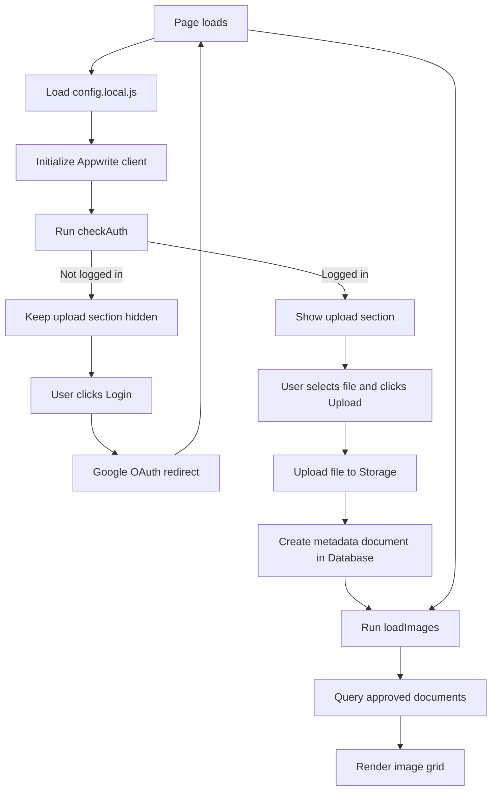
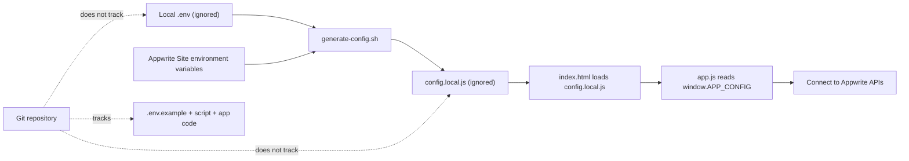

# psych-honours-2026

## Local setup (secret-safe)

1. Copy example env file:
	- `cp .env.example .env`
2. Fill in your Appwrite values in `.env`.
3. Install dependencies:
	- `npm install`
4. Build Tailwind CSS:
	- `npm run build:css`
5. Generate runtime config for the browser:
	- `./scripts/generate-config.sh`
6. Open `index.html` (or run a local static server).

`config.local.js` and `.env` are ignored by Git and should never be committed.

## Deploy on Appwrite Sites (GitHub source)

This repo is set up for Appwrite Sites with environment variables injected at build time.

### Appwrite Site settings

- **Repository:** `sxn-star/psych-honours-2026`
- **Production branch:** `main`
- **Install command:** `npm ci`
- **Build command:** `npm run build:css && bash ./scripts/generate-config.sh`
- **Output directory:** `.`

### Environment variables (in Appwrite Site)

Add these in your Appwrite Site environment settings:

- `APPWRITE_ENDPOINT` = `https://cloud.appwrite.io/v1`
- `APPWRITE_PROJECT_ID` = your project id
- `APPWRITE_BUCKET_ID` = your storage bucket id
- `APPWRITE_DATABASE_ID` = your database id
- `APPWRITE_COLLECTION_ID` = your collection id

### Important security notes

- Do **not** store server API keys in this frontend project.
- Project/database/bucket/collection IDs are configuration values for the client app.
- Access control is enforced by your Appwrite permissions and auth rules.
- `git-secrets` is enabled in this repo as an extra commit-time protection layer.

## App flow diagram

## Config and secret-safe flow

